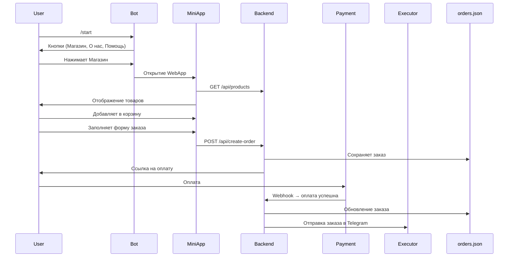

# Telegram_Web_App_Erosia

# 🛍️ Telegram Бот + Mini App (интернет-магазин)

Инструкция и описание архитектуры Telegram-бота, который открывает mini app — React-магазин с оплатой через СБП, корзиной, ПВЗ, и пересылкой заказов исполнителю через Telegram.


## 🧩 Технологии

- **Node.js** — backend API
- **React** — мини-приложение в Telegram (WebApp)
- **Telegram Bot API** — управление ботом
- **JSON-файлы** — вместо БД:
    - `products.json` — каталог товаров
    - `orders.json` — заказы


## 🔁 Сценарий работы

### 1. Старт

- Пользователь запускает `/start`
- Бот отправляет кнопки:
    - 🛍️ Магазин
    - ℹ️ О нас
    - ❓ Помощь


### 2. Мини-приложение (WebApp)

- По нажатию на **“Магазин”** открывается React mini app
- Загружаются товары (`GET /api/products`)
- Пользователь нажимает “Добавить в корзину” → появляется корзина
- Нажимает **“Оформить заказ”** → форма:
    - ФИО
    - Телефон
    - ПВЗ СДЭК
- Кнопка **“Перейти к оплате”** отправляет `POST /api/create-order`


### 3. Backend

- Принимает заказ
- Сохраняет заказ в `orders.json`
- Генерирует ссылку на оплату через СБП
- После оплаты получает `webhook` от платёжной системы
- Отмечает заказ как оплачен
- Отправляет заказ в Telegram исполнителю


### 4. Уведомление исполнителю

Пример сообщения:

```
🛒 Новый заказ!

👤 ФИО: Иванов Иван
📱 Телефон: +79123456789
📍 ПВЗ: Москва, ул. Ленина, д. 5
🔗 Telegram: @ivan_user

📦 Товары:
- Кружка ×2 — 1200 ₽

💳 Оплата: Успешно через СБП
```


### 5. Команды бота

- `/start` — старт, кнопки
- `/help` — описание команд
- **Кнопка “О нас”** — описание магазина
- **Кнопка “Помощь”** — бот просит ввести сообщение → отправляет исполнителю


## 📂 Структура данных

### `products.json`

```json
[  {    "id": 1,    "name": "Кружка",    "price": 600,    "description": "Белая керамическая кружка 350 мл",    "image": "https://example.com/mug.jpg"  }]
```

### `orders.json`

```json
[  {    "id": "ORDER123",    "user_id": 123456789,    "username": "@ivan_user",    "fio": "Иванов Иван",    "phone": "+79123456789",    "pickup_point": "Москва, ул. Ленина, д. 5",    "items": [      { "id": 1, "name": "Кружка", "qty": 2, "price": 600 }    ],    "total": 1200,    "paid": true  }]
```


## ✅ Задачи по ролям

### Backend (Node.js):

- [ ]  Эндпоинты `/api/products`, `/api/create-order`, `/api/payment-callback`
- [ ]  Сохранять заказы в `orders.json`
- [ ]  Интеграция с платёжкой (СБП)
- [ ]  Отправка уведомлений в Telegram

### Frontend (React Mini App):

- [ ]  Каталог, карточки товаров
- [ ]  Корзина
- [ ]  Форма: ФИО, телефон, ПВЗ
- [ ]  Отправка заказа на backend
- [ ]  Обработка статуса оплаты

### Telegram Бот:

- [ ]  Кнопки: Магазин (WebApp), О нас, Помощь
- [ ]  Обработка `/start`, `/help`
- [ ]  Пересылка обращений пользователям


## 📌 Примечания

- Для выбора ПВЗ можно подключить [CDEK Widget](https://cdek.click/)
- Вместо БД используется файловое хранилище — подходит для MVP


## 📦 Пример потока данных




## **🪴PlantUML**

```jsx
@startuml
start

:Пользователь запускает бота (/start);
:Бот отправляет кнопки: Магазин, О нас, Помощь;

if (Пользователь нажимает "Магазин") then (да)
  :Открывается Mini App (React);
  :Загружаются товары из products.json;

  if (Пользователь нажимает "Добавить в корзину") then (да)
    :Отображается корзина;
    :Пользователь нажимает "Оформить заказ";
    :Вводит ФИО, Телефон, ПВЗ СДЭК;
    :Отправка данных на backend (/api/create-order);
    :Сохранение заказа в orders.json;
    :Генерация ссылки на оплату СБП;
    :Переход пользователя на оплату;

      if (Оплата успешна) then (да)
        :Webhook от СБП → backend;
        :Пометка заказа как "оплачен";
        :Формирование текста заказа;
        :Отправка сообщения исполнителю в Telegram;
      else (нет)
        :Показать ошибку оплаты;
      endif

  else (нет)
    :Ожидается добавление товара;
  endif

else (другие кнопки)
  if (Пользователь нажимает "О нас") then (да)
    :Бот отправляет описание магазина;
  else if (Пользователь нажимает "Помощь") then (да)
    :Бот просит ввести сообщение;
    :Пользователь вводит текст;
    :Бот отправляет текст в чат исполнителя;
  endif
endif

stop
@enduml
```
