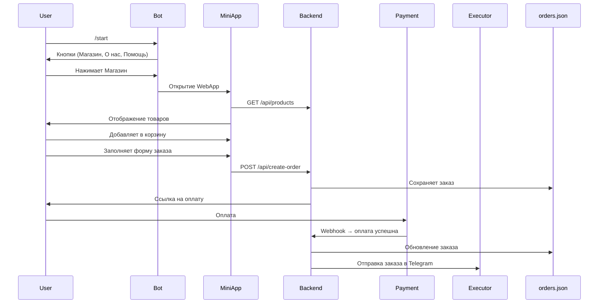

# Telegram_Web_App_Erosia

# 🛍️ Telegram Бот + Mini App (интернет-магазин)

Инструкция и описание архитектуры Telegram-бота, который открывает mini app — React-магазин с оплатой через СБП, корзиной, ПВЗ, и пересылкой заказов исполнителю через Telegram.

---

## 🧩 Технологии

- **Node.js** — backend API
- **React** — мини-приложение в Telegram (WebApp)
- **Telegram Bot API** — управление ботом
- **JSON-файлы** — вместо БД:
    - `products.json` — каталог товаров
    - `orders.json` — заказы

---

## 🔁 Сценарий работы

### 1. Старт

- Пользователь запускает `/start`
- Бот отправляет кнопки:
    - 🛍️ Магазин
    - ℹ️ О нас
    - ❓ Помощь

---

### 2. Мини-приложение (WebApp)

- По нажатию на **“Магазин”** открывается React mini app
- Загружаются товары (`GET /api/products`)
- Пользователь нажимает “Добавить в корзину” → появляется корзина
- Нажимает **“Оформить заказ”** → форма:
    - ФИО
    - Телефон
    - ПВЗ СДЭК
- Кнопка **“Перейти к оплате”** отправляет `POST /api/create-order`

---

### 3. Backend

- Принимает заказ
- Сохраняет заказ в `orders.json`
- Генерирует ссылку на оплату через СБП
- После оплаты получает `webhook` от платёжной системы
- Отмечает заказ как оплачен
- Отправляет заказ в Telegram исполнителю

---

### 4. Уведомление исполнителю

Пример сообщения:

```
🛒 Новый заказ!

👤 ФИО: Иванов Иван
📱 Телефон: +79123456789
📍 ПВЗ: Москва, ул. Ленина, д. 5
🔗 Telegram: @ivan_user

📦 Товары:
- Кружка ×2 — 1200 ₽

💳 Оплата: Успешно через СБП
```

---

### 5. Команды бота

- `/start` — старт, кнопки
- `/help` — описание команд
- **Кнопка “О нас”** — описание магазина
- **Кнопка “Помощь”** — бот просит ввести сообщение → отправляет исполнителю

---

## 📂 Структура данных

### `products.json`

```json
[  {    "id": 1,    "name": "Кружка",    "price": 600,    "description": "Белая керамическая кружка 350 мл",    "image": "https://example.com/mug.jpg"  }]
```

### `orders.json`

```json
[  {    "id": "ORDER123",    "user_id": 123456789,    "username": "@ivan_user",    "fio": "Иванов Иван",    "phone": "+79123456789",    "pickup_point": "Москва, ул. Ленина, д. 5",    "items": [      { "id": 1, "name": "Кружка", "qty": 2, "price": 600 }    ],    "total": 1200,    "paid": true  }]
```

---

## ✅ Задачи по ролям

### Backend (Node.js):

- [ ]  Эндпоинты `/api/products`, `/api/create-order`, `/api/payment-callback`
- [ ]  Сохранять заказы в `orders.json`
- [ ]  Интеграция с платёжкой (СБП)
- [ ]  Отправка уведомлений в Telegram

### Frontend (React Mini App):

- [ ]  Каталог, карточки товаров
- [ ]  Корзина
- [ ]  Форма: ФИО, телефон, ПВЗ
- [ ]  Отправка заказа на backend
- [ ]  Обработка статуса оплаты

### Telegram Бот:

- [ ]  Кнопки: Магазин (WebApp), О нас, Помощь
- [ ]  Обработка `/start`, `/help`
- [ ]  Пересылка обращений пользователям

---

## 📌 Примечания

- Для выбора ПВЗ можно подключить [CDEK Widget](https://cdek.click/)
- Вместо БД используется файловое хранилище — подходит для MVP

---

## 📦 Пример потока данных



---

[PlantUML Web Server](https://www.plantuml.com/plantuml/uml/bLN1Jjj04BtxAqOv9L9RxkH2Fw2NgbBF9fYI0d7ac3jE2WK54K4hKLLL41NNIiR49Gea_CBiB_HB-dQoIxOu1KKHZcFFU_FcpUomqehzADxPtlBanlEM-PmdVAkE-0RV6QUgpRd-JNYGyhtgg8H7kCjLc_YA9tYVKdb9u9Kgy2Vw6UaBedSHcG7UatW0ns2zn_TmcVW7Nbvp2k8XZryGzmclKvNWLeku0yUXEgfwNdsTol_N1Gp_1iMTKLNwbxXKeNWZQ81Xm6d58rhcFi0ZjQkw81ACIbIFtjGRTNhTR5BvRU3NK8p4dcakn7QG8rN79XO4eaAJ4BBSK3CArtPgSUlLnrROW6QYHLL_HSYL-3L45eHash09F9GwLATGYQq5E4I1pwd6XN9QdKOl80V4duJXJkIO_e-qgoNBTWgE2SGWWFYIlt4VhVkfAS41j7Jr765dn1UexnT_jz2-CnuW9LqIH8nLL-s96bhrQvj1OmspvJVhIxKeyEFWPHYj1L75abn0u9wGZ95q3Fcv8rEpPYG8qnK3-oB1kGQgVOX7EnDykf2DmPncbp6zrGwfZXP_mkSp3m75tvwkdH0spz9UaKQ6WiWCHj--G9GSgdjG7cXGiSkIztsmkX66ctAoZ2BwitzgVQhE8itfGHkdrhgEoCs8IW_2FcipIYxwqhOTLod9E2kLZM1K-n6f0oxq5OLDP3uFTHun6vTawff-OFmwrhrw5sm57o9_sn86Mws0ojAhTkLHVIQtZ2O47q3Y5THrNCkxbWZ-rDSzhyWeacNm1-xP6JmSnLixMCwHbuejfs4So8gubaXtpLKMNmGFUt3EUNzwlIAdc6ix1avd4HhPqBkm8cSTFoKAWd2JJFT1Xaykqp8iJ07dpowaRBPRdCchFkU26mmImdo3TFxCzMPjDCrinM7JMy4F_4Vy2m00)